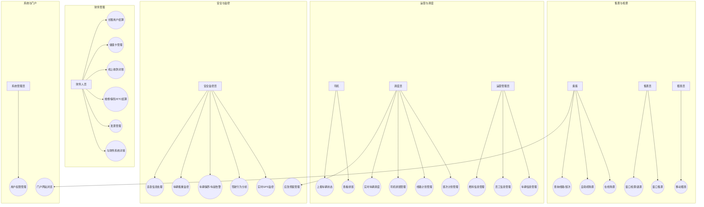
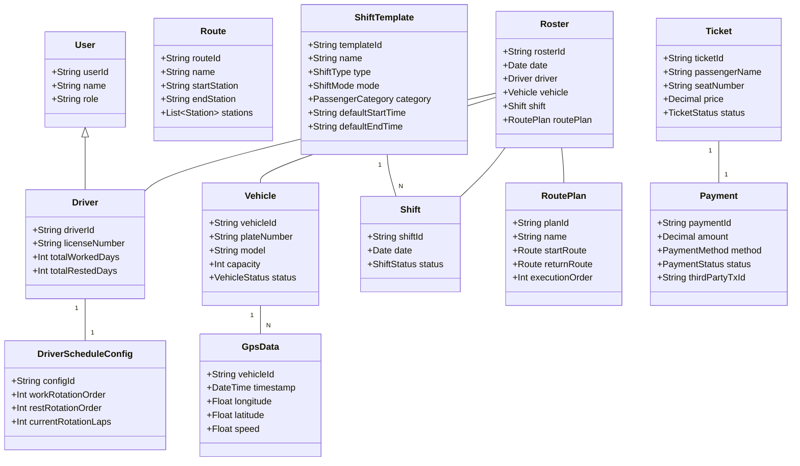
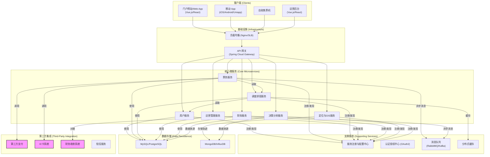

# 机场巴士运营平台架构设计方案

## 1. 引言

本文档旨在为机场巴士运营平台提供一个全面的软件架构设计方案。方案涵盖了系统的核心功能、技术选型、系统结构和潜在风险，旨在为后续的开发工作提供清晰、可靠的指导。

## 2. 用例图

用例图清晰地展示了系统的参与者（Actors）以及他们与系统功能的交互。

### 2.1. 主要参与者

-   **乘客**: 使用平台购票、查询线路信息、查看车辆实时位置。
-   **售票员**: 在窗口进行售票、检票、退票操作。
-   **司机**: 查看排班、上报车辆状态、处理应急事件。
-   **调度员**: 核心用户，负责线路管理、班次计划、司机排班。
-   **运营管理员**: 管理场站、员工、车辆、燃料等基础信息。
-   **财务人员**: 处理各类收款、结算、发票及财务对接。
-   **安全监控员**: 监控车辆和驾驶员安全状态，处理公共安全事件。
-   **系统管理员**: 维护系统稳定，管理用户权限。

### 2.2. 用例图 (Mermaid)

## 3. 类图

类图描述了系统的核心领域模型，展示了关键实体及其之间的关系。**（已根据排班重点需求深化）**

## 4. 技术架构图

本平台采用前后端分离的微服务架构，以确保系统的高可用性、可伸缩性和可维护性。

### 4.1. 技术选型

-   **前端**: Vue.js 3 / React 18 (SPA应用)，移动端可采用Uniapp或原生开发。
-   **后端**: Java 17, Spring Boot 3.x, Spring Cloud Alibaba
-   **数据库**:
    -   MySQL 8.0 / PostgreSQL 15 (业务数据)
    -   Redis (缓存、分布式锁)
    -   MongoDB / InfluxDB (GPS轨迹数据、日志)
-   **消息队列**: RabbitMQ / Apache Kafka (用于服务间异步通信、数据削峰填谷)
-   **网关**: Spring Cloud Gateway / Nginx
-   **服务治理**: Nacos (服务发现、配置中心)
-   **容器化**: Docker, Kubernetes (K8s)
-   **GIS服务**: GeoServer (地图发布), OpenLayers (前端地图展示)
-   **监控**: Prometheus + Grafana + ELK Stack (日志、监控、告警)
-   **CI/CD**: Jenkins, GitLab CI

### 4.2. 架构图 (Mermaid)

### 4.3. 架构说明

1.  **客户端层**: 提供多端入口，包括Web门户、移动App、自助机和内部运营后台，均通过统一的API网关访问后端服务。
2.  **API网关**: 作为系统的唯一入口，负责请求路由、鉴权、限流、日志记录等。
3.  **微服务层**:
    -   **用户服务**: 统一管理用户信息、角色和权限。
    -   **票务服务**: 处理所有售检票逻辑。它将通过独立的适配器层（Adapter Layer）与不同的支付渠道进行解耦集成：通过API网关调用第三方支付（如支付宝、微信支付）；与IC卡系统进行专线或接口集成；并为大客户财务系统提供对账接口以支持转账、支票等线下支付方式的核销。
    -   **调度排班服务**: **系统的绝对核心**。该服务不仅负责常规的线路、班次、司机排班等基础调度功能，**还需内置一套灵活的规则引擎或优化算法**，以处理需求中提到的司机轮询、线路圈数、班次模式等复杂业务逻辑。其设计的优劣直接关系到运营效率和成本，是整个项目的技术关键点和难点。
    -   **运营管理服务**: 负责车辆、员工、场站等基础数据管理。
    -   **财务服务**: 对接内部财务系统，处理结算、对账等。
    -   **定位与GIS服务**: 接收和处理车辆GPS数据，提供简单的GIS功能（如路线规划、行车分析）。
4.  **数据存储层**: 根据数据特性采用不同的存储方案。业务核心数据使用关系型数据库保证事务一致性，GPS和日志等数据使用NoSQL数据库以获得更好的写入和查询性能。
5.  **第三方集成**: 与外部系统解耦，通过定义清晰的接口进行集成。

### 4.4 核心层详细设计

#### 4.4.1 API网关层 (API Gateway)

API网关是系统的统一入口，负责处理所有客户端的请求，并将其智能路由到下游微服务。

-   **核心职责**:
    -   **服务定位与设计哲学**: API网关是整个平台的“数字门卫”。它作为所有外部请求的唯一入口，其核心设计思想是**安全与治理的集中化**。通过在网关层统一处理认证、安全、流控等横切关注点，可以让下游的业务微服务极度纯粹，只需专注于自身业务逻辑，从而实现了业务与技术的解耦，极大地提升了开发效率和系统的可维护性。
    -   **核心能力**:
        -   **请求路由**: 根据请求路径，智能地将流量分发到正确的微服务。
        -   **认证鉴权**: 统一校验用户身份（Token），并向下游服务传递可信的用户信息。
        -   **安全防护**: 作为第一道防线，实施CORS、CSRF、SQL注入等安全策略。
        -   **流量控制**: 扮演“交通警察”的角色，实施限流和熔断，防止系统被流量冲垮。
        -   **可观测性**: 集中记录所有请求的日志和监控指标，为系统提供统一的监控视图。
-   **技术选型**:
    -   选用 `Spring Cloud Gateway`，因为它基于响应式编程模型（Project Reactor），性能高，能很好地与Spring Cloud生态无缝集成。
    -   通过编写自定义的全局过滤器（Global Filters）来实现认证、日志记录等横切关注点。

#### 4.4.2 微服务层 (Microservices)

**1. 用户服务 (User Service)**
-   **核心职责**:
    -   **服务定位与设计哲学**: 这是整个平台的“数字身份基石”。它负责管理所有与“人”相关的数据，包括乘客、司机和内部员工。设计的核心思想是**身份的集中与统一**。通过将用户信息、角色、权限等所有身份相关的逻辑内聚在此服务中，我们确保了身份数据的一致性和权威性，避免了在多个服务中散落和冗余用户信息带来的管理噩梦。
    -   **核心能力**:
        -   **用户管理**: 提供对所有用户信息的CRUD（增删改查）操作。
        -   **身份认证**: 与认证授权中心协作，验证用户凭证，是系统登录流程的核心。
        -   **角色与权限管理**: 定义系统中的角色（如调度员、财务）及其对应的操作权限。
-   **主要实体**: `User`, `Driver`, `Role`, `Permission`。
-   **关键API示例**:
    -   `POST /api/auth/login`: 用户登录，成功后调用认证中心生成Token。
    -   `POST /api/users/register`: 新用户注册。
    -   `GET /api/users/me`: 获取当前登录用户的详细信息。
    -   `GET /api/admin/users`: （管理员）查询用户列表。
-   **数据存储**: 使用MySQL/PostgreSQL存储用户信息。

**2. 票务服务 (Ticketing Service)**
-   **核心职责**:
    -   **服务定位与设计哲学**: 这是平台的“商业交易引擎”。其生命周期从乘客查询班次开始，到成功支付并获得有效车票为止。设计的核心思想是**隔离复杂的交易流程**。票务交易涉及多方集成（支付、IC卡）、状态流转（待支付、已出票、已核销）和高并发场景，将其独立出来，可以使其演进和优化（如增加新的支付渠道）不影响其他核心业务（如排班）。
    -   **核心能力**:
        -   **订单管理**: 创建、管理和查询购票订单，处理订单状态的流转。
        -   **支付集成**: 作为支付的“适配器”，封装与支付宝、微信支付、IC卡系统等多种支付方式的交互逻辑。
        -   **票据管理**: 生成、核销、查询和管理电子票据或实体票据。
-   **主要实体**: `Ticket`, `Order`, `Payment`。
-   **关键API示例**:
    -   `GET /api/schedules`: 查询可售班次信息（数据来源于调度服务）。
    -   `POST /api/orders`: 创建购票订单。
    -   `GET /api/orders/{orderId}/pay`: 获取支付参数，拉起第三方支付。
    -   `POST /api/tickets/{ticketId}/check`: 检票接口。
-   **集成与交互**:
    -   同步调用 **调度排班服务** 获取线路和班次信息。
    -   通过 **API网关** 与 **第三方支付** 系统交互。
    -   通过专线或内网API与 **IC卡系统** 集成。
    -   支付成功后，通过 **消息队列(MQ)** 发布“出票成功”事件，供财务服务等消费。

**3. 调度排班服务 (Scheduling Service)**
-   **核心职责**:
    -   **服务定位与设计哲学**: 这是整个运营平台的“业务大脑”和“决策核心”，是系统内技术复杂度最高的服务。其设计的核心思想是**封装核心调度算法与规则**。排班问题是一个复杂的约束优化问题，涉及大量动态变化的业务规则。将此极端复杂性封装在一个独立的服务中，可以让我们投入最优秀的工程师来攻克这个难题，同时保证其他服务（如票务）的接口简单稳定。
    -   **核心能力**:
        -   **排班计划生成**: 根据线路、班次、车辆、司机状态和一系列复杂规则，自动生成每日排班表。
        -   **资源视图提供**: 向其他服务提供权威的、实时的资源可用性视图（如线路有哪些班次，班次还有多少余票）。
        -   **调度调整**: 支持调度员对自动生成的排班结果进行人工干预和调整。
-   **主要实体**: `Route`, `ShiftTemplate`, `RoutePlan`, `DriverScheduleConfig`, `Roster`。
-   **内部组件**: 需要内建一个 **规则引擎 (Rule Engine)** 或独立的 **算法模块** 来处理复杂的、可配置的排班逻辑。
-   **关键API示例**:
    -   `POST /api/admin/rosters/generate`: （调度员）触发生成指定日期的排班表。
    -   `PUT /api/admin/rosters/{rosterId}`: （调度员）手动调整排班。
    -   `GET /api/schedules`: 向 **票务服务** 提供可售班次和余票信息。
    -   `GET /api/drivers/{driverId}/schedule`: （司机）查询自己的排班。
-   **数据存储**: 使用MySQL存储排班数据，使用Redis缓存生成的排班表以提高查询性能。

**4. 运营管理服务 (Operation Service)**
-   **核心职责**:
    -   **服务定位与设计哲学**: 这是运营平台的“数字档案室”。它负责管理所有运营中相对静态但至关重要的基础数据，即“人、车、路、站”的数字档案。设计的核心思想是**分离基础数据与交易数据**。将这些变更频率较低的基础数据（Master Data）与票务、排班等高频交易数据（Transactional Data）分离，可以保证核心档案的稳定和清晰，简化系统的数据模型。
    -   **核心能力**:
        -   **车辆管理**: 维护车辆的完整生命周期信息，从购入、保养、维修到报废。
        -   **线路与场站管理**: 维护公交线路、经停站点、发车场站等地理和物理信息。
        -   **员工管理**: 管理除身份信息外的员工档案（如合同、岗位等）。
        -   **物料管理**: 记录燃料、维修配件等物料的消耗。
-   **主要实体**: `Vehicle`, `Station`, `Employee`, `FuelRecord`, `MaintenanceRecord`。
-   **关键API示例**:
    -   `POST /api/admin/vehicles`: 新增车辆信息。
    -   `GET /api/admin/vehicles/{vehicleId}/maintenance`: 查询车辆保养记录。
    -   `POST /api/admin/fuel/records`: 记录燃料加注信息。

**5. 财务服务 (Finance Service)**
-   **核心职责**:
    -   **服务定位与设计哲学**: 这是平台的“自动记账中心”。它不直接参与实时交易，而是作为后台的账本，默默记录所有与金钱相关的流水。其设计的核心思想是**采用事件驱动的异步解耦**。财务系统不应阻塞核心交易流程（如出票），通过异步监听“支付成功”、“退款发起”等业务事件来记账，可以极大地提升主流程的性能和稳定性，保证系统间财务数据的最终一致性。
    -   **核心能力**:
        -   **对账与结算**: 定期（如每日）与第三方支付、银行等渠道进行账务核对，并处理内部结算。
        -   **成本与费用管理**: 记录和核算运营中产生的各项成本（如燃料、维修、ETC、保险）。
        -   **财务报表**: 为管理层提供多维度的财务分析报表。
-   **主要实体**: `Settlement`, `Invoice`, `ExpenseRecord`。
-   **工作模式**:
    -   **事件驱动**: 监听来自 **消息队列(MQ)** 的支付成功、退款成功等事件，进行异步记账。
    -   **定时任务 (Batch Job)**: 运行每日/每月的对账和结算任务。
-   **关键API示例**:
    -   `GET /api/admin/reports/financial`: 生成财务报表。
    -   `POST /api/admin/settlements/corporate`: 处理大客户结算。
-   **集成与交互**: 与企业内部的 **财务收款系统** 通过接口或数据库进行对接。

**6. 定位与GIS服务 (GPS Service)**
-   **核心职责**:
    -   **服务定位与设计哲学**: 这是平台的“实时千里眼”，为系统提供物理世界的实时视图。其设计的核心思想是**隔离高并发的时序数据流**。车载GPS数据具有高并发、高吞吐、时序性的特点，其技术栈和数据模型与传统业务（CRUD）截然不同。将其独立为一个服务，可以使用专门的技术（如MQTT、Netty、时序数据库）来应对挑战，避免冲击主业务系统。
    -   **核心能力**:
        -   **数据接入**: 提供稳定、高并发的接入点，实时接收和解析车载终端上报的GPS数据。
        -   **轨迹管理**: 存储和查询车辆的历史轨迹。
        -   **地理空间分析**: 提供实时位置查询、地理围栏告警等GIS功能。
-   **主要实体**: `GpsData`, `VehicleTrack`, `GeoFence`。
-   **技术要点**:
    -   **数据接入**: 需要提供高并发的接入点（如MQTT Broker或基于Netty的TCP Server）来接收车载终端上报的数据。
    -   **数据存储**: 使用MongoDB或InfluxDB等NoSQL数据库，它们对时序数据和地理空间查询有更好的支持。
-   **关键API示例**:
    -   `GET /api/vehicles/{vehicleId}/location`: 查询车辆实时位置。
    -   `GET /api/vehicles/{vehicleId}/track`: 查询车辆历史轨迹。
    -   `POST /api/geofence/alerts`: （内部接口）当车辆进出地理围栏时，通过MQ发送告警。

**7. 决策分析服务 (Decision Service)**
-   **核心职责**:
    -   **服务定位与设计哲学**: 这是平台的“商业智能（BI）中心”。它不参与任何在线交易，其存在是为了回答“过去发生了什么？”以及“未来可能怎样？”这类分析性问题。设计的核心思想是**读写分离与数据聚合**。复杂的分析查询（OLAP）如果直接在交易数据库（OLTP）上运行，会严重影响主业务性能。因此，我们建立一个独立的数据管道，将各业务库的数据聚合到专门的数据仓库中，实现分析与交易的彻底分离。
    -   **核心能力**:
        -   **数据抽取与转换（ETL）**: 定期从各个业务数据库抽取数据，并清洗、转换为适合分析的统一模型。
        -   **数据报表**: 提供多维度的、可交互的业务报表，如客流量分析、线路收益分析、准点率分析等。
        -   **决策支持**: 为线路优化、班次调整等运营决策提供数据依据。
-   **工作模式**: 本质上是一个 **数据管道 (Data Pipeline)** + **报表系统**。
    -   通过ETL/ELT工具，定期从各个业务服务的数据库（MySQL）和GPS服务的数据库（MongoDB）中抽取数据。
    -   将数据清洗、聚合后存入一个专门用于分析的 **数据仓库** 或 **数据集市**。
-   **关键API示例**:
    -   `GET /api/reports/sales/summary`: 获取销售数据概览。
    -   `GET /api/reports/operations/efficiency`: 分析运营效率（如准点率、满座率）。

## 5. 风险评估

| 风险类别 | 风险描述                                                                                              | 可能性 | 影响程度 | 应对策略                                                                                                         |
| :------- | :---------------------------------------------------------------------------------------------------- | :----- | :------- | :--------------------------------------------------------------------------------------------------------------- |
| **技术风险** | **排班算法复杂性**: 排班是系统的核心与难点，要设计出既满足复杂业务规则（如轮询、圈数）又能灵活调整的调度算法，技术挑战巨大。 | 高     | 高       | 1. 项目初期采用基于规则的半自动排班，满足基本需求。 2. 投入专门的算法工程师进行研究，或与高校、专业公司合作。 3. 采用迭代开发，逐步优化算法。 |
| **技术风险** | **GIS应用开发**: 团队缺乏GIS相关知识背景，学习成本高，可能导致GIS功能模块开发延期或质量不达标。         | 中     | 高       | 1. 引入第三方成熟的地图服务API（如高德、百度地图）。 2. 聘请GIS专家或提供专项培训。 3. 初期仅实现核心定位和轨迹展示功能。 |
| **技术风险** | **高并发售票**: 在节假日等高峰期，线上售票系统可能面临高并发压力，导致系统响应缓慢或崩溃。              | 中     | 高       | 1. 设计弹性的、可水平扩展的票务服务。 2. 使用消息队列进行流量削峰。 3. 引入缓存机制，缓存热门线路和班次信息。 4. 进行充分的压力测试。 |
| **技术风险** | **数据一致性**: 在微服务架构下，跨服务的分布式事务会带来数据一致性的挑战。                                | 高     | 高       | 1. 优先采用最终一致性方案（如基于消息队列的事件驱动模式）。 2. 对于强一致性场景，可采用Seata等分布式事务框架。 |
| **人员风险** | **决策分析系统研发**: 决策分析模块需要具备数据分析和算法能力的专业人员，可能存在人才招聘困难。        | 中     | 中       | 1. 初期与业务专家合作，实现基于规则的统计分析报表。 2. 考虑引入第三方BI工具。 3. 逐步培养或招聘数据分析人才。 |
| **集成风险** | **外部系统对接**: 与第三方支付、IC卡、财务系统对接时，可能因接口不稳定、协议变更等问题导致集成失败。 | 中     | 高       | 1. 签订详细的技术协议，明确接口规范和责任。 2. 设计好防腐层（Anti-Corruption Layer），隔离外部变化。 3. 建立熔断和降级机制。 |
| **安全风险** | **数据安全**: 系统涉及支付信息、乘客个人信息等敏感数据，存在数据泄露风险。                          | 中     | 高       | 1. 严格遵守数据安全法规。 2. 对敏感数据进行加密存储。 3. 实施严格的访问控制和权限管理。 4. 定期进行安全审计和渗透测试。 |

