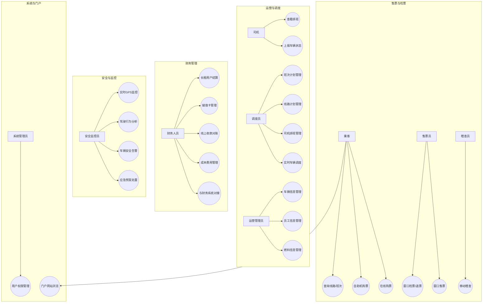
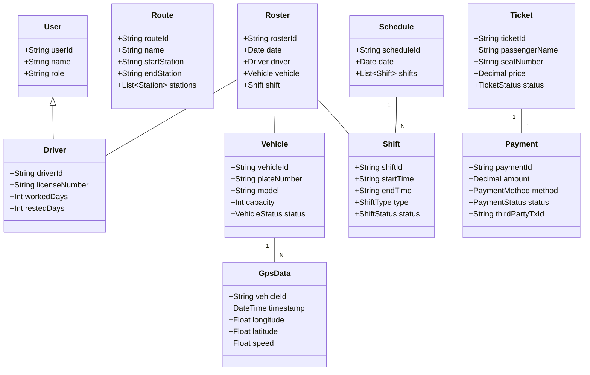
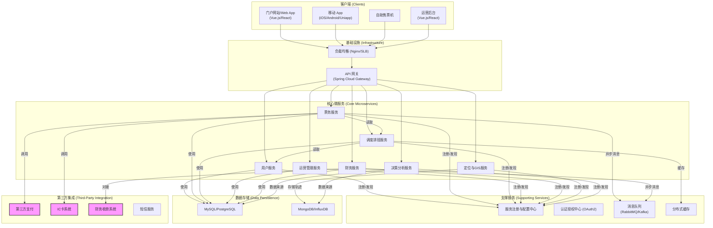

# 机场巴士运营平台架构设计方案

## 1. 引言

本文档旨在为机场巴士运营平台提供一个全面的软件架构设计方案。方案涵盖了系统的核心功能、技术选型、系统结构和潜在风险，旨在为后续的开发工作提供清晰、可靠的指导。

## 2. 用例图

用例图清晰地展示了系统的参与者（Actors）以及他们与系统功能的交互。

### 2.1. 主要参与者

-   **乘客**: 使用平台购票、查询线路信息、查看车辆实时位置。
-   **售票员**: 在窗口进行售票、检票、退票操作。
-   **司机**: 查看排班、上报车辆状态、处理应急事件。
-   **调度员**: 核心用户，负责线路管理、班次计划、司机排班。
-   **运营管理员**: 管理场站、员工、车辆、燃料等基础信息。
-   **财务人员**: 处理各类收款、结算、发票及财务对接。
-   **安全监控员**: 监控车辆和驾驶员安全状态，处理公共安全事件。
-   **系统管理员**: 维护系统稳定，管理用户权限。

### 2.2. 用例图 (Mermaid)

## 3. 类图

类图描述了系统的核心领域模型，展示了关键实体及其之间的关系。

## 4. 技术架构图

本平台采用前后端分离的微服务架构，以确保系统的高可用性、可伸缩性和可维护性。

### 4.1. 技术选型

-   **前端**: Vue.js 3 / React 18 (SPA应用)，移动端可采用Uniapp或原生开发。
-   **后端**: Java 17, Spring Boot 3.x, Spring Cloud Alibaba
-   **数据库**:
    -   MySQL 8.0 / PostgreSQL 15 (业务数据)
    -   Redis (缓存、分布式锁)
    -   MongoDB / InfluxDB (GPS轨迹数据、日志)
-   **消息队列**: RabbitMQ / Apache Kafka (用于服务间异步通信、数据削峰填谷)
-   **网关**: Spring Cloud Gateway / Nginx
-   **服务治理**: Nacos (服务发现、配置中心)
-   **容器化**: Docker, Kubernetes (K8s)
-   **GIS服务**: GeoServer (地图发布), OpenLayers (前端地图展示)
-   **监控**: Prometheus + Grafana + ELK Stack (日志、监控、告警)
-   **CI/CD**: Jenkins, GitLab CI

### 4.2. 架构图 (Mermaid)

### 4.3. 架构说明

1.  **客户端层**: 提供多端入口，包括Web门户、移动App、自助机和内部运营后台，均通过统一的API网关访问后端服务。
2.  **API网关**: 作为系统的唯一入口，负责请求路由、鉴权、限流、日志记录等。
3.  **微服务层**:
    -   **用户服务**: 统一管理用户信息、角色和权限。
    -   **票务服务**: 处理所有售检票逻辑，并与第三方支付、IC卡系统集成。
    -   **调度排班服务**: 系统的核心，负责线路、班次、司机排班等复杂调度逻辑。
    -   **运营管理服务**: 负责车辆、员工、场站等基础数据管理。
    -   **财务服务**: 对接内部财务系统，处理结算、对账等。
    -   **定位与GIS服务**: 接收和处理车辆GPS数据，提供简单的GIS功能（如路线规划、行车分析）。
    -   **决策分析服务**: 基于业务数据和GPS数据进行数据分析，为决策提供支持。
4.  **数据存储层**: 根据数据特性采用不同的存储方案。业务核心数据使用关系型数据库保证事务一致性，GPS和日志等数据使用NoSQL数据库以获得更好的写入和查询性能。
5.  **第三方集成**: 与外部系统解耦，通过定义清晰的接口进行集成。

## 5. 风险评估

| 风险类别 | 风险描述                                                                                              | 可能性 | 影响程度 | 应对策略                                                                                                         |
| :------- | :---------------------------------------------------------------------------------------------------- | :----- | :------- | :--------------------------------------------------------------------------------------------------------------- |
| **技术风险** | **GIS应用开发**: 团队缺乏GIS相关知识背景，学习成本高，可能导致GIS功能模块开发延期或质量不达标。         | 中     | 高       | 1. 引入第三方成熟的地图服务API（如高德、百度地图）。 2. 聘请GIS专家或提供专项培训。 3. 初期仅实现核心定位和轨迹展示功能。 |
| **技术风险** | **高并发售票**: 在节假日等高峰期，线上售票系统可能面临高并发压力，导致系统响应缓慢或崩溃。              | 中     | 高       | 1. 设计弹性的、可水平扩展的票务服务。 2. 使用消息队列进行流量削峰。 3. 引入缓存机制，缓存热门线路和班次信息。 4. 进行充分的压力测试。 |
| **技术风险** | **数据一致性**: 在微服务架构下，跨服务的分布式事务会带来数据一致性的挑战。                                | 高     | 高       | 1. 优先采用最终一致性方案（如基于消息队列的事件驱动模式）。 2. 对于强一致性场景，可采用Seata等分布式事务框架。 |
| **人员风险** | **决策分析系统研发**: 决策分析模块需要具备数据分析和算法能力的专业人员，可能存在人才招聘困难。        | 中     | 中       | 1. 初期与业务专家合作，实现基于规则的统计分析报表。 2. 考虑引入第三方BI工具。 3. 逐步培养或招聘数据分析人才。 |
| **集成风险** | **外部系统对接**: 与第三方支付、IC卡、财务系统对接时，可能因接口不稳定、协议变更等问题导致集成失败。 | 中     | 高       | 1. 签订详细的技术协议，明确接口规范和责任。 2. 设计好防腐层（Anti-Corruption Layer），隔离外部变化。 3. 建立熔断和降级机制。 |
| **安全风险** | **数据安全**: 系统涉及支付信息、乘客个人信息等敏感数据，存在数据泄露风险。                          | 中     | 高       | 1. 严格遵守数据安全法规。 2. 对敏感数据进行加密存储。 3. 实施严格的访问控制和权限管理。 4. 定期进行安全审计和渗透测试。 |

