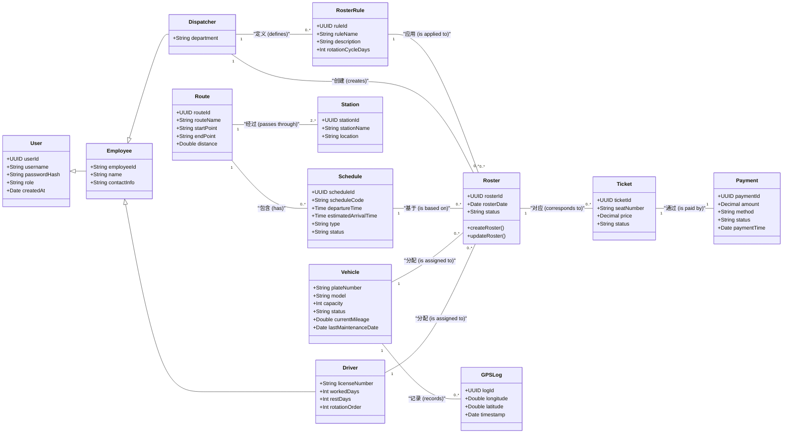

# 机场巴士运营平台类图

本图展示了机场巴士运营平台的核心业务实体及其关系，重点突出了调度排班模块。

```mermaid
classDiagram
    direction LR

    class User {
        +UUID userId
        +String username
        +String passwordHash
        +String role
        +Date createdAt
    }

    class Employee {
        +String employeeId
        +String name
        +String contactInfo
    }
    User <|-- Employee

    class Driver {
        +String licenseNumber
        +Int workedDays
        +Int restDays
        +Int rotationOrder
    }
    Employee <|-- Driver

    class Dispatcher {
        +String department
    }
    Employee <|-- Dispatcher

    class Vehicle {
        +String plateNumber
        +String model
        +Int capacity
        +String status
        +Double currentMileage
        +Date lastMaintenanceDate
    }

    class Route {
        +UUID routeId
        +String routeName
        +String startPoint
        +String endPoint
        +Double distance
    }

    class Station {
        +UUID stationId
        +String stationName
        +String location
    }

    class Schedule {
        +UUID scheduleId
        +String scheduleCode
        +Time departureTime
        +Time estimatedArrivalTime
        +String type
        +String status
    }

    class Roster {
        +UUID rosterId
        +Date rosterDate
        +String status
        +createRoster()
        +updateRoster()
    }

    class RosterRule {
        +UUID ruleId
        +String ruleName
        +String description
        +Int rotationCycleDays
    }

    class Ticket {
        +UUID ticketId
        +String seatNumber
        +Decimal price
        +String status
    }

    class Payment {
        +UUID paymentId
        +Decimal amount
        +String method
        +String status
        +Date paymentTime
    }
    
    class GPSLog {
        +UUID logId
        +Double longitude
        +Double latitude
        +Date timestamp
    }

    %% Relationships
    Driver "1" -- "0..*" Roster : "分配 (is assigned to)"
    Vehicle "1" -- "0..*" Roster : "分配 (is assigned to)"
    Schedule "1" -- "0..*" Roster : "基于 (is based on)"
    Dispatcher "1" -- "0..*" Roster : "创建 (creates)"
    
    Route "1" -- "0..*" Schedule : "包含 (has)"
    Route "1" -- "2..*" Station : "经过 (passes through)"
    
    Roster "1" -- "0..*" Ticket : "对应 (corresponds to)"
    Ticket "1" -- "1" Payment : "通过 (is paid by)"

    Vehicle "1" -- "0..*" GPSLog : "记录 (records)"
    
    RosterRule "1" -- "0..*" Roster : "应用 (is applied to)"
    Dispatcher "1" -- "0..*" RosterRule : "定义 (defines)"

```
